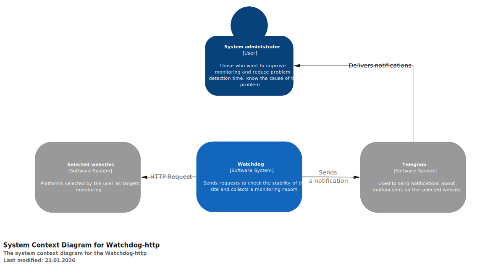
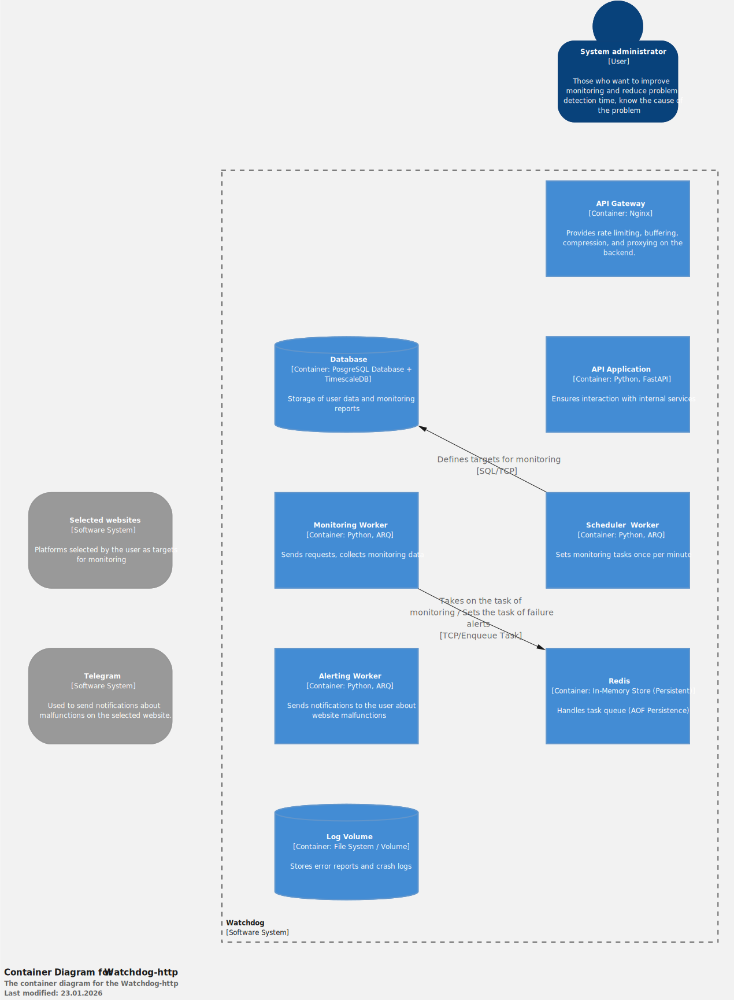

# 🛡️ Watchdog-http (ver 0.8.2)

**Watchdog** is an autonomous, asynchronous web monitoring system. It performs background health checks on target APIs and websites, records performance metrics (latency, status codes) into **TimescaleDB**, and instantly alerts owners via Telegram.

## Key Features

* **Autonomous Monitoring:** Background workers (ARQ) execute checks independently.
* **Time-Series Metrics:** High-performance storage of latency and status codes using TimescaleDB.
* **Instant Alerts:** Real-time notifications via Telegram when a service goes down.
* **Resilient Architecture:** Built with retry policies and queue persistence (Redis).

---

## 🏗 Architecture

### C1: Context (System Landscape)
*High-level view of how the system interacts with users and external services.*

### C2: Containers (High-Level Technical View)

👀 <b>Click to expand detailed container diagram</b>

 

*This diagram illustrates the internal services, data flow, and technologies used.*

---

## 🛠 Tech Stack

The project relies on a modern asynchronous Python stack focused on high performance and scalability.

| Component | Technology | Description |
| :--- | :--- | :--- |
| **Core** | **Python 3.11+** | Modern async syntax support. |
| **Web Framework** | **FastAPI** | High-performance API handling with automatic validation. |
| **Data Validation** | **Pydantic V2** | Robust data modeling and serialization. |
| **Database** | **PostgreSQL** + **TimescaleDB** | SQL storage optimized for time-series data (metrics). |
| **ORM / Migrations** | **SQLAlchemy 2.0** + **Alembic** | Asynchronous ORM and schema migration management. |
| **Task Queue** | **Redis** + **ARQ** | Lightweight distributed task queue for background checks. |
| **HTTP Client** | **httpx** | Fully asynchronous HTTP client for making health checks. |
| **Infrastructure** | **Docker Compose** | Container orchestration for easy deployment. |
| **Reverse Proxy** | **Nginx** | Handling incoming traffic and providing security. |