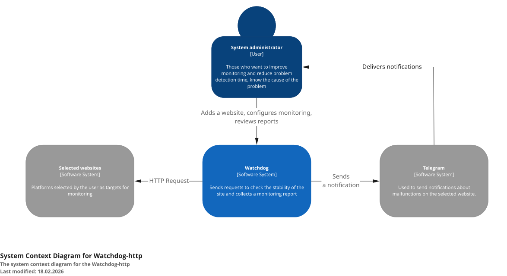
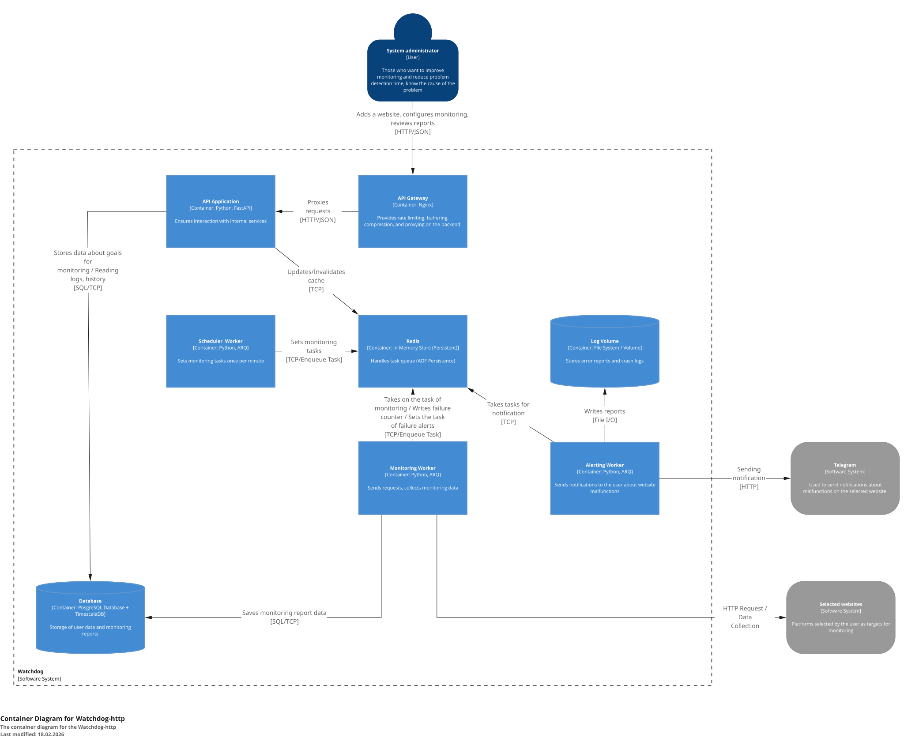

# 🛡️ Watchdog HTTP


[](https://opensource.org/licenses/MIT)

**Watchdog** is an autonomous, asynchronous web-monitoring system. Background workers continuously run HTTP health checks on your APIs and websites, persist time-series metrics in TimescaleDB, and deliver real-time incident alerts to Telegram — without any manual intervention.

---

## Features

- **Autonomous background monitoring** — ARQ workers run HTTP checks on a configurable schedule with no client polling required.
- **Anti-flapping** — consecutive-failure thresholds and state-transition logic prevent alert storms caused by transient glitches. See [docs/alerting/ANTI_FLAPPING.md](docs/alerting/ANTI_FLAPPING.md).
- **Instant Telegram alerts** — down / recovery notifications sent by a dedicated alerting worker, fully decoupled from the check loop.
- **Time-series metrics** — latency and status codes stored in TimescaleDB for historical analysis.
- **REST API + Swagger UI** — manage monitors and users through a documented FastAPI interface.
- **Streamlit dashboard** — real-time visualization of monitor health and historical trends.
- **Structured JSON logging** — every worker and API event is machine-readable; pipe through `jq` out of the box.
- **Full test suite** — 204 tests (unit + integration), `mypy`-clean, `black`-formatted.

---

## Architecture

### C1 — System Context

*High-level view of how Watchdog interacts with users and external services.*



### C2 — Container Diagram

<details>
<summary>Click to expand</summary>
<br>

*Internal services, data flow, and technologies.*



</details>

### C3 — API Component Diagram

<details>
<summary>Click to expand</summary>
<br>

*FastAPI application's internal structure and dependencies.*

.svg)

</details>

---

## Tech Stack

| Layer | Technology | Role |
| :--- | :--- | :--- |
| Web framework | **FastAPI** | REST API, authentication, request validation |
| Workers | **ARQ** (Redis-backed) | Background health checks, scheduler, alert dispatch |
| Database | **TimescaleDB / PostgreSQL 14** | Persistent storage, time-series metrics |
| ORM / Migrations | **SQLAlchemy 2.0 + Alembic** | Async ORM, schema versioning |
| Cache / Queue | **Redis 7** | Job queue, monitor config cache, state tracking |
| HTTP client | **httpx** | Async HTTP health checks |
| Notifications | **Telegram Bot API + aiogram** | Alert delivery, interactive bot |
| Dashboard | **Streamlit** | Visual monitoring interface |
| Reverse proxy | **Nginx** | Traffic routing, single entry point |
| Validation | **Pydantic V2** | Data modeling and settings |
| Logging | **structlog** | Structured JSON logs |
| Infrastructure | **Docker Compose** | Container orchestration |

## Platform Support

This project is designed for Unix-like environments (Linux and macOS). Native Windows execution (CMD/PowerShell) is not supported. If you need to run on Windows, use WSL2 or a compatible Unix-like environment.

---

## Project Structure

```
watchdog-http/
├── src/                        # Main application (FastAPI + workers)
│   ├── config/                 # Settings (pydantic-settings)
│   ├── core/                   # DB engine, dependencies, logging
│   ├── models/                 # SQLAlchemy ORM models
│   ├── repositories/           # DB access layer
│   ├── services/               # Business logic
│   ├── routes/                 # FastAPI routers
│   ├── schemas/                # Pydantic schemas
│   ├── worker/                 # ARQ workers (monitoring + alerting)
│   ├── telegram/               # Telegram notifier + interactive bot
│   ├── migrations/             # Alembic versions
│   └── tests/                  # Unit + integration tests
├── ui/                         # Streamlit dashboard
├── nginx/                      # Nginx config + Dockerfile
├── docs/                       # Project documentation
├── scripts/                    # Utility scripts (version sync)
├── docker-compose.yml          # Production stack
├── docker-compose.override.yml # Dev additions (hot reload)
├── docker-compose.test.yml     # Isolated test infrastructure
├── .env.example                # Template for production env
├── .env.test.example           # Template for test env
└── Makefile                    # All common commands
```

---

## Quick Start

> For a detailed walkthrough, see [docs/GETTING_STARTED.md](docs/GETTING_STARTED.md).

### 1. Install dependencies

```bash
git clone <repo-url> watchdog-http && cd watchdog-http
make install
```

### 2. Configure environment

```bash
cp .env.example .env
# Fill in DB credentials, Redis host/port, and Telegram bot token
```

Optionally enable hot reload for development:

```bash
cp docker-compose.override.example.yml docker-compose.override.yml
```

### 3. Start the stack

```bash
make docker-up    # builds images on first run, starts all services
make upgrade      # apply database migrations
```

### 4. Create your first user and monitor

```bash
# Register — note your api_key in the response
curl -X POST http://localhost/api/users/

# Add a monitor (replace YOUR_API_KEY)
curl -X POST http://localhost/api/monitors/add-urls \
  -H "X-API-Key: YOUR_API_KEY" \
  -H "Content-Type: application/json" \
  -d '[{"url": "https://example.com", "name": "Example", "interval": 60}]'
```

### 5. Access the services

| Service | URL |
| :--- | :--- |
| Streamlit dashboard | http://localhost/ |
| Swagger UI | http://localhost/docs |
| API | http://localhost/api/ |
| Health check | http://localhost/health |

---

## Running Tests

> For full details, see [docs/testing/TESTING.md](docs/testing/TESTING.md).

```bash
# Configure the test env (use ports 5433 / 6380 for the test containers)
cp .env.test.example .env.test

# Start isolated test containers (postgres:5433, redis:6380)
make test-infra-up

# Run everything
make test

# With HTML coverage report
make test-cov

# Unit tests only (no Docker required)
cd src && poetry run pytest tests -m unit
```

---

## Code Quality

```bash
make check      # Black formatting + mypy type checking
make format     # Format only
make lint       # Type-check only
```

---

## Common Commands

```bash
make help                   # list all available targets
make docker-logs            # stream all container logs
make docker-logs service=app  # stream one service
make db-reset               # wipe and re-apply all migrations (⚠ destructive)
make clean                  # remove __pycache__, .mypy_cache, etc.
make sync-version SET=2.0.0  # bump version in README, pyproject.toml, main.py
```

---

## Documentation

| Document | Description |
| :--- | :--- |
| [docs/GETTING_STARTED.md](docs/GETTING_STARTED.md) | Full setup guide: clone → configure → run → test |
| [docs/configuration/ENV.md](docs/configuration/ENV.md) | All environment variables explained |
| [docs/configuration/DOCKER.md](docs/configuration/DOCKER.md) | Docker Compose files deep-dive |
| [docs/testing/TESTING.md](docs/testing/TESTING.md) | Test architecture, fixtures, markers, coverage |
| [docs/alerting/ANTI_FLAPPING.md](docs/alerting/ANTI_FLAPPING.md) | How alert-spam prevention works |
| [docs/logging/README.md](docs/logging/README.md) | Structured logging overview |
| [docs/logging/events.md](docs/logging/events.md) | Complete event catalog |
| [docs/logging/analysis.md](docs/logging/analysis.md) | Log analysis with `jq` |
| [docs/tools/MAKEFILE.md](docs/tools/MAKEFILE.md) | Makefile commands reference |
| [docs/tools/VERSION_SYNC.md](docs/tools/VERSION_SYNC.md) | Version bump script |
